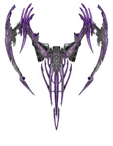
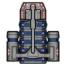
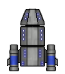
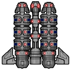

# Save the Planet, Commander!

## About

This game is a project for the Object Orientation Programming course in [University of Brasilia](https://www.unb.br/).

## Player controls

<kbd>↑</kbd> - move **up**

<kbd>↓</kbd> - move **down**

<kbd>←</kbd> - move **left**

<kbd>→</kbd> - move **right**

<kbd>spacebar</kbd> - **shoot** lasers

Things to note before playing:

## Mobs

* **Aliens**: There are **three** races of aliens.
	*  Kroks, contains 1 HP.
	*  Werbs, contains 2 HP.
	*  Zerds, contains 3 HP.

 

* **Alien Boss**:

The boss has 500 *hitpoints* and as its hitpoints decreases, it gets faster and angrier, this means it will shoot more lasers towards you.

## Bonuses

The bonuses will always drop in mid game, but when in the *Boss Fight*, the boss' laser beams will destroy them.

* **Life Heart** - +1 HP.

* **Gear** - Gears allow your spaceship to evolve.

* **Gems** - Increase score.

## Spaceships

* : Level 1, unidirectional laser beam

* : Level 2 (After collecting 5 *gears*), bidirectional laser beam

* : Level 3 (After collecting 10 *gears*), shoots laser beams from **three** guns.

## Stages

Your mission is made out of **four** stages:

### First Stage (score under 10.000 points)

Contais *Kroks* and *Werbs* only.

### Second Stage (score above 10.000 points and under 30.000)

Contais *Kroks* and *Werbs* in a higher proportion.

### Third Level (score above 30.000)

Contais *Werbs* and *Zerds* in a higher proportion.

### Boss Fight

Alien rain stops and their leader come to face you!

## Credits

* Special thanks to [Shtrom](https://soundcloud.com/shtrom) for the great soundtrack!

* Thanks [Code Inferno Games](https://opengameart.org/users/codeinfernogames) for the Gems sprites!

* Thanks [MillionthVector](http://millionthvector.blogspot.com.br/) for the awesome aliens/spaceships artwork!

## Music

* Shtrom - 05.09.14
