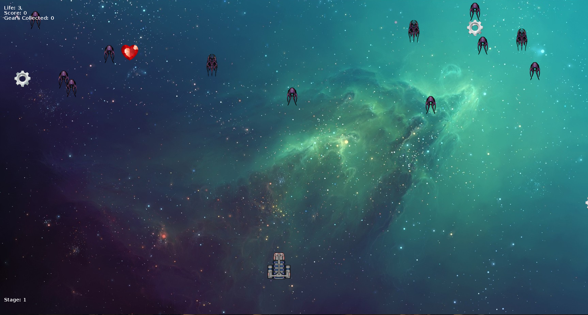
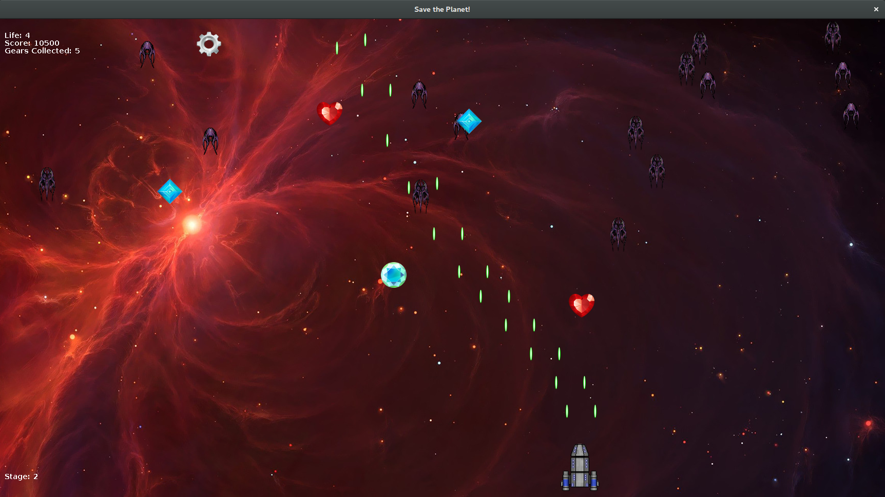
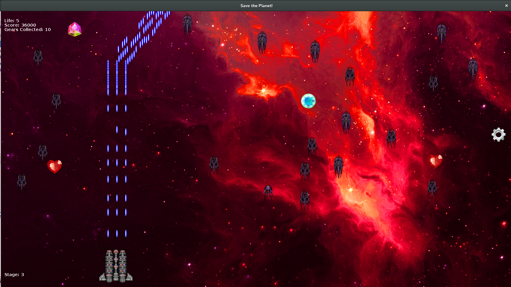
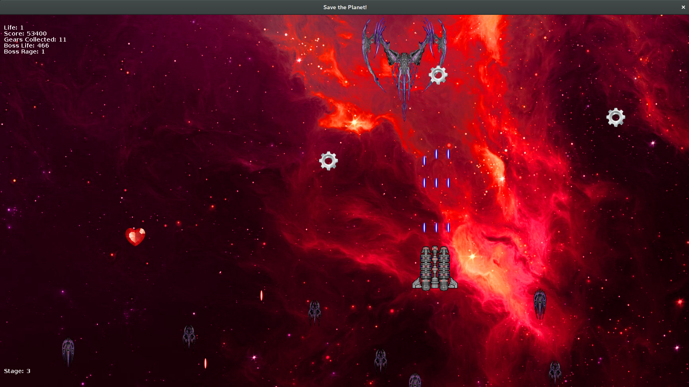

## Save the Planet, Commander!

Este projeto consiste em um jogo onde você controla a espaçonave que deve derrotar o  General Zoid que pretende dominar o mundo. Só você pode nos salvar! 
 
Para controlar a espaçonave use:
```
↑- para mover para cima
 
↓- para mover para baixo
 
← - para mover para esquerda
 
→ - para mover para direita

espaço - para atirar lasers
```

Sobre os **Aliens**:

Aliens fáceis: morrem com apenas um laser.

Aliens médios: morrem quando atingidos por dois lasers.

Aliens difíceis: morrem somente quando atingidos por três lasers.

Boss: possui 500HP e atira lasers, quanto menor sua vida, mais rápido ele se move e mais lasers ele atira (Tome cuidado!).

O jogo possui 4 estágios e fica gradativamente mais difícil de se concluir seu objetivo, preste atenção:

**Primeiro nível** (pontuacao < 10.000): 
	Aliens de níveis fáceis e médios começam a aparecer.
	
Stage 1 screenshot 

**Segundo nível** (10.000 < pontuacao < 30.000):
	Aliens somente de níveis médio começam a aparecer e com maior frequência.
	
Stage 2 screenshot 

**Terceiro nível** (pontuacao > 30.000): 
	Aliens de níveis médios e difíceis começam a aparecer e com maior frequência.
	
Stage 3 screenshot 

**Final Boss** (Boss Fight):
	Final Boss: você enfrentara o General na batalha final. (Aliens param de surgir durante a batalha do boss).

Boss Stage screenshot  

Sobre os **bônus**:
(Os bônus apareceram com frequência contínua mesmo durante a batalha do boss, porem os lasers atirados pelo boss destruirao os bonus).

**Vida** - Aumenta a vida da espaçonave em 1.

**Engrenagem** - Engrenagens servem para fazer upgrade na espaçonave:

5 engrenagens = espaçonave nível 2.

10 engrenagens = espaçonave nível 3.

Gemas - Aumentam a pontuação.
 
Boa sorte, comandante, o mundo conta com você!

Desenvolvido por: Gabriel Ziegler, aluno de Engenharia de Software da Universidade de Brasilia.

Desenvolvido em: Netbeans 8.1


Credits:

Special Thanks to [Shtrom](https://soundcloud.com/shtrom/) for the great soundtrack!
```Gametrack: Shtrom - 05.09.14``` 

Thanks [Code Inferno Games](https://opengameart.org/users/codeinfernogames) for the Gems sprites!

Thanks [MillionthVector](http://millionthvector.blogspot.com.br/) for the awesome aliens/spaceships artwork!
